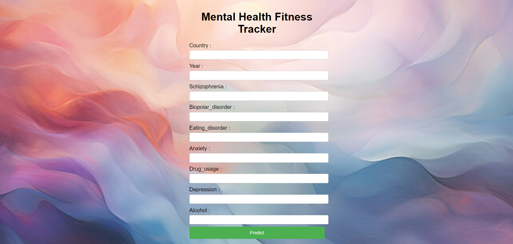
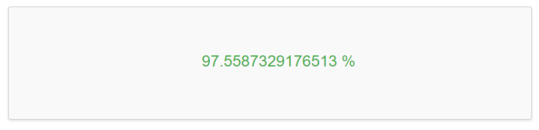

# Mental Fitness Tracker
### Technologies used: HTML, CSS, JavaScript, Flask, Machine Learning
The Mental Health Fitness Tracker is a web application I developed during my *IBM internship* to help users monitor and improve their mental well-being. In today's busy world, it's crucial to care for our mental health, and this tool offers an easy way to track various aspects of mental fitness.
Using machine learning regression models, the application predicts a mental health fitness score based on the user's input, providing insights that can guide positive lifestyle changes. While it's a useful tool, it is not a replacement for professional mental health advice. For serious concerns, please consult a qualified mental health professional.

### Description
In our hectic daily lives, prioritizing mental health is crucial. The Mental Health Fitness Tracker offers an easy-to-use platform that allows users to monitor different aspects of their mental well-being and gain valuable insights. By leveraging machine learning regression models, the app predicts a mental health fitness score based on user-provided numerical and textual data. This score can provide meaningful insights into one's mental health and help guide positive lifestyle changes.

### Input Page

### Mental Fitness Tracker - OUTPUT

## Technologies Used

The Mental Fitness Tracker project utilizes the following technologies:

- HTML
- CSS (including inline CSS for styling)
- JavaScript (including inline JavaScript for basic interactivity)
- Flask (for back-end server and handling requests)
- Machine learning libraries (for the regression model)

